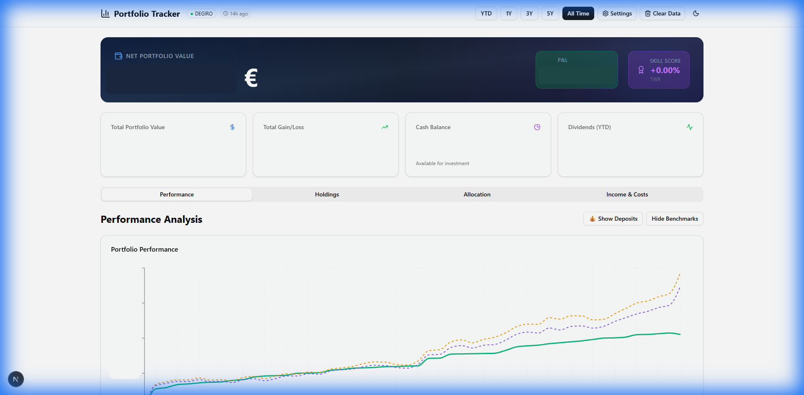

# 📈 DEGIRO Portfolio Tracker

A powerful portfolio analysis tool for **DEGIRO** users that transforms your CSV exports into beautiful visualizations and professional-grade performance metrics.



## ✨ Features

| Feature                          | Description                                                   |
| -------------------------------- | ------------------------------------------------------------- |
| 📊**Performance Metrics**  | TWR, MWR/IRR, CAGR, Sharpe Ratio, Sortino Ratio, Max Drawdown |
| 📈**Interactive Charts**   | Portfolio value over time with benchmark comparisons          |
| 🎯**Benchmark Comparison** | Compare your returns against S&P 500 and MSCI World           |
| 🏷️**AI Classification**  | Automatic sector, geography, and asset class detection        |
| 🤖**AI Portfolio Analyst** | Get personalized insights powered by Google Gemini            |
| 💱**Multi-Currency**       | Automatic EUR/USD/GBP/CHF conversion                          |
| 🔒**Privacy-First**        | All data stays on your computer - nothing is uploaded         |

---

## 📋 Prerequisites

Before you begin, make sure you have:

- ✅ **Node.js 18+** installed ([Download here](https://nodejs.org/))
- ✅ A **DEGIRO** account with transaction history
- ✅ A **RapidAPI account** (free tier available)
- ✅ A **Google AI Studio account** (free tier available)

---

## 🚀 Installation

### Step 1: Download the Project

**Option A: Download ZIP**

1. Click the green **"Code"** button above
2. Select **"Download ZIP"**
3. Extract the ZIP file to a folder on your computer

**Option B: Clone with Git**

```bash
git clone https://github.com/YOUR_USERNAME/portfolio-tracker.git
cd portfolio-tracker
```

### Step 2: Install Dependencies

Open a terminal/command prompt in the project folder and run:

```bash
npm install
```

### Step 3: Configure API Keys

1. Find the file `.env.example` in the project folder
2. **Copy** it and rename the copy to `.env.local`
3. Open `.env.local` in a text editor and fill in your API keys (see next section)

---

## 🔑 API Key Setup

You need **2 API keys** to use all features. Both have free tiers! With monthly or daily limits.

### 1. RapidAPI Key (for stock prices & exchange rates)

1. Go to [RapidAPI](https://rapidapi.com/) and create a free account
2. Search for "[Real-Time Finance Data](https://rapidapi.com/letscrape-6bRBa3QguO5/api/real-time-finance-data)" and "yahoo-finance166"
3. Click **"Subscribe to Test"** (Basic plan is free) for both APIs
4. Copy your **API Key** from the header examples (you need only one)
5. Paste it in `.env.local`:
   ```
   RAPIDAPI_KEY=your_key_here
   ```

### 2. Google Gemini API Key (for AI classification & analysis)

1. Go to [Google AI Studio](https://aistudio.google.com/apikey)
2. Sign in with your Google account
3. Click **"Create API Key"**
4. Copy the key and paste it in `.env.local`:
   ```
   GEMINI_API_KEY_PORTFOLIO=your_key_here
   ```

Your final `.env.local` should look like:

```env
RAPIDAPI_KEY=abc123xyz...
RAPIDAPI_HOST=real-time-finance-data.p.rapidapi.com
RAPIDAPI_HOST_FALLBACK=yahoo-finance166.p.rapidapi.com
GEMINI_API_KEY_PORTFOLIO=AIza...
```

---

## 📤 Exporting Data from DEGIRO

1. Log in to your **DEGIRO** account
2. Go to **Activity** → **Account Overview**
3. Click **Export** and download:
   - `Account.csv` - Cash flows, dividends, fees
   - `Portfolio.csv` - Current holdings (from Portfolio page)
   - `Transactions.csv` - All buy/sell transactions

> 💡 **Tip**: Make sure to download in **Italian** locale format, or check the `samples/` folder for expected column headers.

---

## 🎮 Running the App

1. Open a terminal in the project folder
2. Run:
   ```bash
   npm run dev
   ```
3. Open your browser and go to: **http://localhost:3000**
4. Upload your DEGIRO CSV files and explore your portfolio!

---

## 📁 CSV File Format

The app expects DEGIRO CSV exports with these columns:

### Account.csv

| Column      | Description         | Example      |
| ----------- | ------------------- | ------------ |
| Data        | Date (DD-MM-YYYY)   | 15-12-2025   |
| Ora         | Time                | 09:30        |
| Prodotto    | Product name        | APPLE INC    |
| ISIN        | Security identifier | US0378331005 |
| Descrizione | Transaction type    | Dividendo    |
| Variazioni  | Amount change       | 2,40         |
| Saldo       | Balance             | 150,00       |

### Portfolio.csv

| Column        | Description   | Example      |
| ------------- | ------------- | ------------ |
| Prodotto      | Product name  | APPLE INC    |
| Codice        | ISIN          | US0378331005 |
| Quantità     | Quantity held | 10           |
| Ultimo        | Last price    | 195,00       |
| Valore in EUR | Value in EUR  | 1820,00      |

### Transactions.csv

| Column     | Description         | Example      |
| ---------- | ------------------- | ------------ |
| Data       | Date                | 15-12-2025   |
| Prodotto   | Product name        | APPLE INC    |
| ISIN       | Security identifier | US0378331005 |
| Quantità  | Quantity            | 10           |
| Quotazione | Price per share     | 190,00       |
| Totale EUR | Total in EUR        | -1774,00     |

> 📂 Sample files are available in the `samples/` folder!

---

## 🔧 Troubleshooting

### "API rate limit exceeded"

The free RapidAPI tier has limited requests. Wait a few minutes and try again, or:

- The app caches data for 12 hours - subsequent loads use cached data
- You can manually set fallback exchange rates in `config/fallback-rates.json`

### "Invalid date" warnings

Some DEGIRO exports have multi-line descriptions. The app handles these gracefully - values are skipped but your portfolio still works.

### API Keys not working

- Make sure `.env.local` exists (not `.env.example`)
- Restart the dev server after changing `.env.local`
- Check there are no extra spaces in your API keys

---

## 🤝 Contributing

Contributions are welcome! Please read our [Contributing Guidelines](CONTRIBUTING.md) before submitting a pull request.

---

## 📄 License

This project is licensed under the MIT License - see the [LICENSE](LICENSE) file for details.

---

## ⚠️ Disclaimer

This tool is for **informational purposes only**. It is not financial advice. Always verify calculations with official statements from your broker. The developers are not responsible for any investment decisions made based on this tool.
