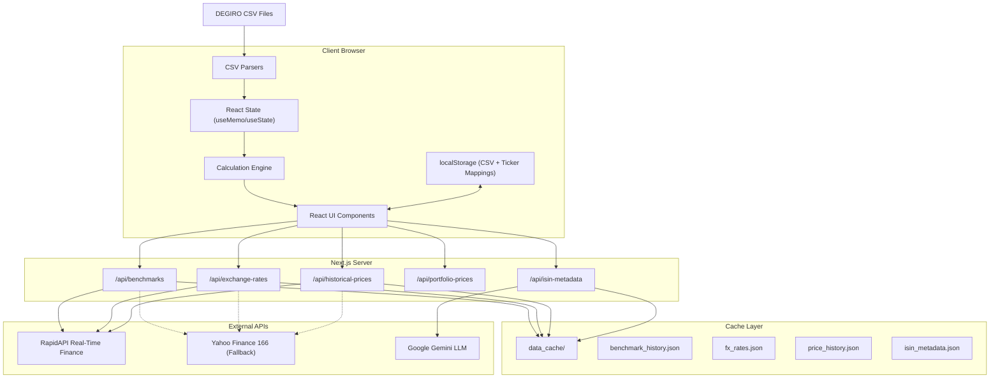
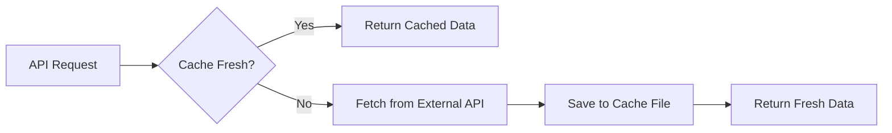
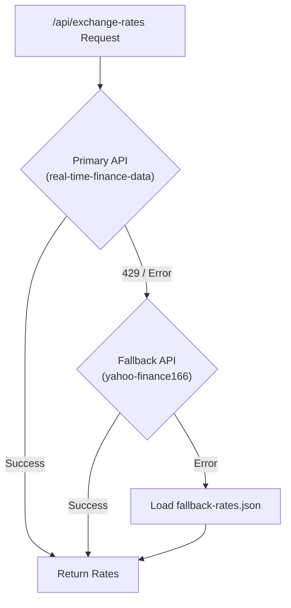
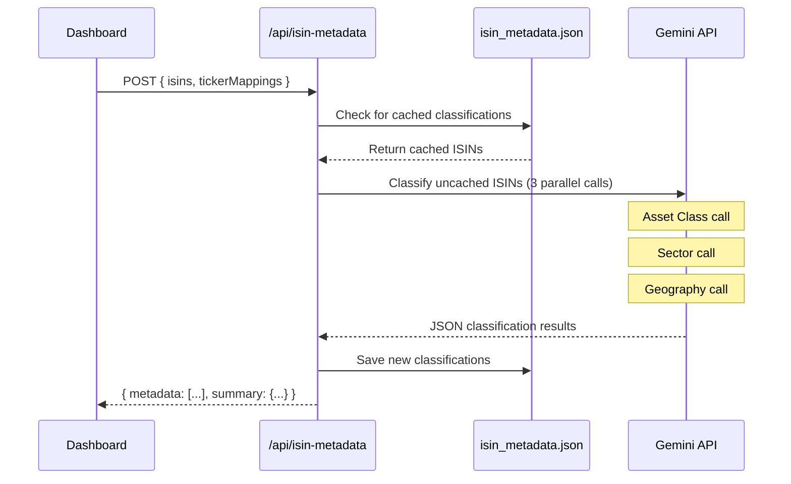

# DEGIRO Portfolio Tracker - Technical Architecture Report

> **Purpose**: This document provides a comprehensive technical overview for AI evaluators and developers to analyze the application's logic, processes, and IT architecture.

---

## 1. System Overview

### 1.1 Application Purpose
A client-side web application that parses DEGIRO broker CSV exports to calculate and visualize portfolio performance metrics, including comparisons against market benchmarks (S&P 500, MSCI World).

### 1.2 Technology Stack

| Layer | Technology | Version |
|-------|------------|---------|
| **Framework** | Next.js (App Router) | 16.1.1 |
| **Language** | TypeScript | 5.x |
| **UI Library** | React | 19.2.3 |
| **Styling** | Tailwind CSS | 4.x |
| **Charts** | Recharts | 3.6.0 |
| **UI Components** | Radix UI | 2.x |
| **CSV Parsing** | PapaParse | 5.5.3 |
| **Date Utilities** | date-fns | 4.1.0 |
| **Icons** | Lucide React | 0.562.0 |
| **AI/LLM** | Google Gemini API | v1beta |

---

## 2. Architecture Diagram



---

## 3. Directory Structure

```
portfolio-tracker/
├── config/
│   ├── cache-config.json         # Configurable cache freshness hours
│   ├── fallback-rates.json       # Manual FX fallback rates
│   ├── gemini-analyst.json       # AI analyst prompts + configuration
│   └── gemini-classification.json # Gemini models + sector/asset lists
├── data_cache/                   # File-system cache (gitignored)
│   ├── benchmark_history.json
│   ├── fx_rates.json
│   ├── price_history.json
│   ├── fx_history.json
│   └── isin_metadata.json
├── src/
│   ├── app/
│   │   ├── api/
│   │   │   ├── benchmarks/route.ts        # S&P 500 + MSCI World with caching
│   │   │   ├── exchange-rates/route.ts    # FX rates with 3-tier fallback
│   │   │   ├── historical-prices/route.ts # Stock price history
│   │   │   ├── portfolio-analyst/route.ts # AI portfolio analysis
│   │   │   ├── portfolio-prices/route.ts  # Batch price fetching
│   │   │   └── isin-metadata/route.ts     # Gemini classification
│   │   ├── globals.css
│   │   ├── layout.tsx
│   │   └── page.tsx
│   ├── components/
│   │   ├── Dashboard.tsx           # Main dashboard
│   │   ├── FileUpload.tsx          # CSV upload handler
│   │   ├── Charts.tsx              # Recharts visualizations
│   │   ├── MetricsDisplay.tsx      # Performance metrics UI
│   │   ├── PortfolioAnalyst.tsx    # AI-powered portfolio analysis panel
│   │   ├── NorthStarMetrics.tsx    # Top-level KPI cards
│   │   ├── Tables.tsx              # Holdings/positions tables
│   │   ├── Sparkline.tsx           # 30-day trend mini-charts
│   │   ├── TimePeriodSelector.tsx  # YTD/1Y/3Y/5Y selector
│   │   ├── TickerMappingPanel.tsx  # ISIN-to-ticker mapping UI
│   │   └── ui/                     # Radix-based UI primitives
│   ├── lib/
│   │   ├── calculations/
│   │   │   ├── metrics.ts          # 11 financial calculation functions
│   │   │   └── portfolioCalculator.ts # Historical portfolio value
│   │   ├── data/
│   │   │   └── isinMapping.ts      # ISIN metadata (from Gemini cache)
│   │   ├── hooks/
│   │   │   ├── useIsinMetadata.ts  # Fetch ISIN classification
│   │   │   ├── usePortfolioPrices.ts
│   │   │   └── usePortfolioStorage.ts # localStorage persistence
│   │   ├── parsers/
│   │   │   ├── accountParser.ts
│   │   │   ├── portfolioParser.ts
│   │   │   └── transactionParser.ts
│   │   ├── services/
│   │   │   ├── geminiAnalystService.ts    # AI portfolio analyst
│   │   │   ├── geminiClassificationService.ts # Gemini LLM integration
│   │   │   ├── priceService.ts     # Price fetching with cache
│   │   │   ├── rapidApiService.ts
│   │   │   └── yahooApiService.ts  # Yahoo Finance fallback
│   │   └── utils/
│   │       ├── cacheConfig.ts      # Load cache settings
│   │       └── format.ts           # Italian locale utilities
│   └── types/
│       └── index.ts
└── .env.local                      # API keys (gitignored)
```

---

## 4. Caching Architecture

### 4.1 File-System Cache

All API responses are cached to `data_cache/` with configurable freshness:

```json
// config/cache-config.json
{
  "cacheFreshnessHours": 20
}
```

| Cache File | Data | Freshness |
|------------|------|-----------|
| `benchmark_history.json` | SPY + URTH 5Y history | 20h |
| `fx_rates.json` | EUR/USD, EUR/GBP, EUR/CHF | 20h |
| `price_history.json` | Individual stock prices | 20h |
| `isin_metadata.json` | Gemini classification results | Permanent |

### 4.2 Cache Flow



---

## 5. API Fallback Strategy

### 5.1 Three-Tier Fallback



### 5.2 API Configuration

```env
# .env.local
RAPIDAPI_KEY=your_key
RAPIDAPI_HOST=real-time-finance-data.p.rapidapi.com
RAPIDAPI_HOST_FALLBACK=yahoo-finance166.p.rapidapi.com
GEMINI_API_KEY_PORTFOLIO=your_gemini_key
```

---

## 6. Gemini LLM Classification

### 6.1 Overview

Securities are classified by Google Gemini LLM with Google Search grounding:

| Classification | Options |
|----------------|---------|
| **Asset Class** | Stock, ETF, ADR, Bond, Fund, Crypto, REIT, Commodity, Cash |
| **Sector** | 50 options (Technology, Financials, Healthcare, etc.) |
| **Geography** | Country names (USA, China, Germany, etc.) |

### 6.2 Model Fallback Chain

```json
// config/gemini-classification.json
{
  "models": {
    "primary": "gemini-3-flash-preview",
    "secondary": "gemini-flash-latest",
    "tertiary": "gemini-2.5-flash"
  },
  "enableGrounding": true
}
```

### 6.3 Classification Flow



---

## 7. API Endpoints

### 7.1 GET /api/benchmarks

**Purpose**: Fetch historical benchmark index data with caching

**Features**:
- 20-hour file-system cache
- Yahoo Finance 166 fallback on rate limit
- Returns SPY (S&P 500) and URTH (MSCI World)

### 7.2 GET /api/exchange-rates

**Purpose**: Fetch live forex rates

**Features**:
- 3-tier fallback (Primary → Yahoo → Config file)
- 20-hour file-system cache
- Supports EUR, USD, GBP, CHF, GBX

### 7.3 POST /api/isin-metadata

**Purpose**: Classify securities using Gemini LLM

**Input**:
```typescript
{
  isins: string[];
  tickerMappings: Record<string, { ticker: string; name: string }>;
}
```

**Output**:
```typescript
{
  metadata: IsinMetadata[];
  summary: { total: number; cached: number; classified: number };
}
```

---

## 8. Calculation Engine

### 8.1 Performance Metrics

Located in `src/lib/calculations/metrics.ts`

| Metric | Function | Formula |
|--------|----------|---------|
| **TWR** | `calculateTWR()` | `[(1+R₁) × (1+R₂) × ... × (1+Rₙ)] - 1` |
| **MWR/IRR** | `calculateMWR()` | Newton-Raphson: `∑[CFₜ / (1+IRR)^t] = 0` |
| **CAGR** | `calculateCAGR()` | `(EndValue / StartValue)^(1/years) - 1` |
| **Sharpe** | `calculateSharpeRatio()` | `(Rₚ - Rᶠ) / σₚ` |
| **Sortino** | `calculateSortinoRatio()` | `(Rₚ - Rᶠ) / σd` (downside only) |
| **Max Drawdown** | `calculateMaxDrawdown()` | Largest peak-to-trough decline |
| **Volatility** | `calculateVolatility()` | Annualized standard deviation |
| **Alpha** | `calculateAlphaBeta()` | `Rₚ - [Rᶠ + β × (Rₘ - Rᶠ)]` |
| **Beta** | `calculateAlphaBeta()` | `Cov(Rₚ, Rₘ) / Var(Rₘ)` |

---

## 9. State Management

### 9.1 Storage Layers

| Layer | Mechanism | Data |
|-------|-----------|------|
| **Session** | React useState/useMemo | Parsed CSV data, calculations |
| **Persistent** | localStorage | CSV files, ticker mappings |
| **Server Cache** | File system (data_cache/) | API responses |

### 9.2 Key Hooks

| Hook | Purpose |
|------|---------|
| `usePortfolioStorage` | localStorage persistence for CSV + mappings |
| `useIsinMetadata` | Fetch Gemini classification on load |
| `usePortfolioPrices` | Batch fetch historical prices |

---

## 10. Security Considerations

| Aspect | Implementation |
|--------|----------------|
| **API Keys** | Stored in `.env.local` (gitignored) |
| **CSV Data** | Client-side only, stored in localStorage |
| **Cache Files** | Server-side only in `data_cache/` (gitignored) |
| **Gemini API** | Uses separate `GEMINI_API_KEY_PORTFOLIO` |

---

## 11. Testing Commands

```bash
# Development server
npm run dev

# Production build
npm run build

# Type checking
npx tsc --noEmit

# Clear all caches
Remove-Item .\data_cache\* -Force
```

---

## 12. Known Limitations

1. **Rate Limits**: Primary API frequently returns 429, relies on fallback chain
2. **Gemini Classification**: Requires valid API key; falls back to ISIN-based geography
3. **Single Currency**: All values displayed in EUR
4. **Monthly Granularity**: Performance chart uses monthly data points

---

*Report updated: 2025-12-30*
*Application version: 0.1.0*
